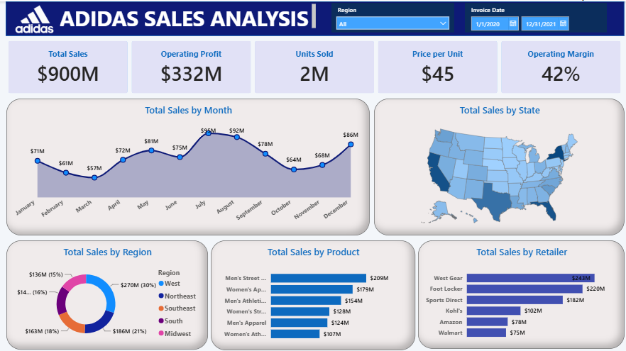

👟 Adidas Sales Analysis Dashboard – Power BI

📌 Project Overview

This project is an interactive Adidas Sales Analysis Dashboard developed using Power BI. It provides insights into sales performance, operating profit, units sold, regional sales and product performance.

🎯 Project Objectives

- Analyze overall sales and operating profit.
- Track monthly sales trends.
- Understand state-wise and region-wise sales performance.
- Analyze product-wise sales.
- Compare sales performance across different retailers.

📊 Key Performance Indicators

- Total Sales: $900M
- Operating Profit: $332M
- Units Sold: 2M
- Price per Unit: $45
- Operating Margin: 42%

📈 Dashboard Analysis

- Total Sales by Month
- Total Sales by State
- Total Sales by Region
- Total Sales by Product
- Total Sales by Retailer

🎛️ Interactive Filters

- Region
- Invoice Date

🛠️ Tools & Technologies

- Microsoft Power BI
- DAX
- Power Query
- Excel 

🖼️ Dashboard Preview

📁 Project Files

- "Adidas_Sales_Dashboard.pbix" – Power BI dashboard file
- "Adidas_Sales_Dashboard.png" – Dashboard preview

👩‍💻 Author

Aishwarya Bodakhe

Data Analytics Project | Power BI
